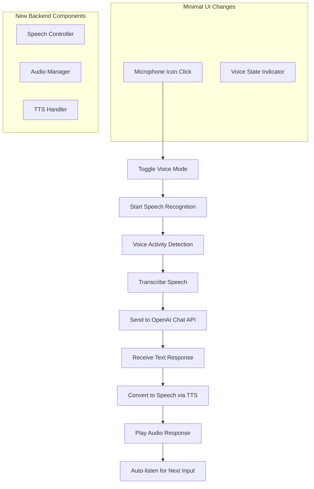

# Speech/Conversational AI Integration Plan
## Portfolio Site - Dylan Keay (dyln.bk)

---

## Executive Summary

This plan outlines the integration of OpenAI's speech capabilities into the existing portfolio chat system to enable full bidirectional voice conversation. The implementation focuses on minimal visual changes while adding powerful speech functionality through a simple microphone toggle in the existing chat input area.

---

## Current System Analysis

### Existing Architecture
- **Tech Stack**: Vite + Vanilla JavaScript + Three.js + jQuery
- **Dependencies**: OpenAI v4.0.0, marked.js, DOMPurify
- **Chat Implementation**: [`main/chat.js`](main/chat.js) with streaming GPT-4o responses
- **API Management**: Netlify function for secure API key handling
- **UI Structure**: Embedded chat interface with existing send button

### Current Data Flow
```
User Input → handleChat() → OpenAI API → Streaming Response → UI Update
```

### Key Files
- [`main/chat.js`](main/chat.js) - Main chat logic with streaming
- [`main/index.html`](main/index.html) - Chat UI structure
- [`main/style.css`](main/style.css) - Theming and chat styles
- [`main/netlify/functions/manageAPIKey.js`](main/netlify/functions/manageAPIKey.js) - API key management

---

## Technical Architecture

### Speech Integration Flow



### API Integration Strategy

**Primary Approach: Web Speech API + OpenAI TTS**
- **Speech-to-Text**: Browser's native Web Speech API (no additional API calls)
- **Text-to-Speech**: OpenAI TTS API for consistent, high-quality voice
- **Chat Logic**: Enhance existing [`chat.js`](main/chat.js) with audio capabilities
- **API Key**: Use existing LOCAL_GPT_API_KEY from [`.env`](main/.env)

---

## Implementation Plan

### 1. Minimal UI Changes

#### 1.1 Microphone Icon Integration
**Location**: Inside existing [`.chat-input`](main/index.html:68) container, next to send button

```html
<!-- Enhanced chat-input structure -->
<div class="chat-input" style="opacity: 0;">
  <textarea placeholder="Enter a message..." required></textarea>
  <span class="mic-toggle" id="micToggle">
    <svg class="mic-icon"><!-- Microphone SVG --></svg>
  </span>
  <span></span>
</div>
```

#### 1.2 Visual States
- **Inactive**: Standard microphone icon (matches existing design)
- **Active/Listening**: Subtle color change or pulse animation
- **Processing**: Brief loading state
- **No additional UI elements**: No status text, no permission dialogs, no settings

#### 1.3 CSS Integration
```css
/* Minimal additions to existing style.css */
.mic-toggle {
  display: flex;
  align-items: center;
  justify-content: center;
  cursor: pointer;
  padding: 8px;
  border-radius: 4px;
  transition: all 0.2s ease;
}

.mic-toggle.active {
  color: var(--clr-text-accent);
  background: var(--clr-surface-a20);
}

.mic-icon {
  width: 20px;
  height: 20px;
  fill: currentColor;
}
```

### 2. Core Speech Components

#### 2.1 New File Structure
```
main/
├── speech/
│   ├── speechController.js      # Main speech coordination
│   ├── audioManager.js          # Audio input/output handling
│   └── speechSynthesis.js       # OpenAI TTS integration
└── assets/
    └── mic-icon.svg            # Microphone icon
```

#### 2.2 Speech Controller Implementation
```javascript
// speech/speechController.js
class SpeechController {
  constructor(chatHandler) {
    this.chatHandler = chatHandler;
    this.isListening = false;
    this.recognition = null;
    this.audioManager = new AudioManager();
    this.tts = new SpeechSynthesis();
    this.initializeSpeechRecognition();
  }

  toggle() {
    if (this.isListening) {
      this.stopListening();
    } else {
      this.startListening();
    }
  }

  async startListening() {
    try {
      this.isListening = true;
      this.updateUI('listening');
      this.recognition.start();
    } catch (error) {
      this.handleError(error);
    }
  }

  stopListening() {
    this.isListening = false;
    this.recognition.stop();
    this.updateUI('inactive');
  }

  async handleSpeechResult(transcript) {
    if (transcript.trim()) {
      // Use existing chat handler
      await this.chatHandler.processMessage(transcript);
    }
  }

  async speakResponse(text) {
    const audioBlob = await this.tts.synthesize(text);
    await this.audioManager.playAudio(audioBlob);
    
    // Auto-resume listening after response
    if (this.isListening) {
      setTimeout(() => this.recognition.start(), 500);
    }
  }
}
```

#### 2.3 Audio Manager
```javascript
// speech/audioManager.js
class AudioManager {
  constructor() {
    this.audioContext = null;
    this.currentAudio = null;
  }

  async playAudio(audioBlob) {
    return new Promise((resolve) => {
      const audio = new Audio(URL.createObjectURL(audioBlob));
      this.currentAudio = audio;
      
      audio.onended = () => {
        URL.revokeObjectURL(audio.src);
        resolve();
      };
      
      audio.play();
    });
  }

  stopAudio() {
    if (this.currentAudio) {
      this.currentAudio.pause();
      this.currentAudio = null;
    }
  }
}
```

#### 2.4 OpenAI TTS Integration
```javascript
// speech/speechSynthesis.js
class SpeechSynthesis {
  constructor() {
    this.apiKey = null;
    this.initializeAPIKey();
  }

  async initializeAPIKey() {
    const response = await fetch('/.netlify/functions/manageAPIKey');
    const data = await response.json();
    this.apiKey = data.key;
  }

  async synthesize(text, voice = 'alloy') {
    const response = await fetch('https://api.openai.com/v1/audio/speech', {
      method: 'POST',
      headers: {
        'Authorization': `Bearer ${this.apiKey}`,
        'Content-Type': 'application/json'
      },
      body: JSON.stringify({
        model: 'tts-1',
        input: text,
        voice: voice,
        response_format: 'mp3'
      })
    });

    if (!response.ok) {
      throw new Error(`TTS API Error: ${response.statusText}`);
    }

    return response.blob();
  }
}
```

### 3. Enhanced Chat Integration

#### 3.1 Modified [`chat.js`](main/chat.js) Integration
```javascript
// Enhanced chat.js additions
let speechController = null;

// Initialize speech controller
document.addEventListener('DOMContentLoaded', () => {
  speechController = new SpeechController({
    processMessage: handleSpeechMessage
  });
  
  // Add microphone click handler
  document.getElementById('micToggle').addEventListener('click', () => {
    speechController.toggle();
  });
});

// New function to handle speech messages
const handleSpeechMessage = async (transcript) => {
  // Set the transcript as user message
  userMessage = transcript;
  
  // Use existing chat flow
  const safeMessage = DOMPurify.sanitize(escapeHTML(userMessage));
  chatbox.appendChild(createChatLi(safeMessage, "outgoing"));
  chatbox.scrollTo(0, chatbox.scrollHeight);

  // Generate response using existing logic
  const incomingChatLi = createChatLi("", "incoming");
  chatbox.appendChild(incomingChatLi);
  
  await generateResponse(incomingChatLi, () => {
    // On first chunk, speak the response when complete
    speechController.speakResponse(assistantMessage);
  });
};

// Enhanced generateResponse to support speech
const generateResponse = async (chatElement, onFirstChunk) => {
  // ... existing implementation ...
  
  // After response is complete, trigger speech if in voice mode
  if (speechController && speechController.isListening) {
    await speechController.speakResponse(assistantMessage);
  }
};
```

### 4. Browser Speech Recognition Setup

#### 4.1 Web Speech API Implementation
```javascript
// In speechController.js
initializeSpeechRecognition() {
  if (!('webkitSpeechRecognition' in window) && !('SpeechRecognition' in window)) {
    console.warn('Speech recognition not supported');
    return;
  }

  const SpeechRecognition = window.SpeechRecognition || window.webkitSpeechRecognition;
  this.recognition = new SpeechRecognition();
  
  this.recognition.continuous = false;
  this.recognition.interimResults = false;
  this.recognition.lang = 'en-US';

  this.recognition.onresult = (event) => {
    const transcript = event.results[0][0].transcript;
    this.handleSpeechResult(transcript);
  };

  this.recognition.onerror = (event) => {
    this.handleError(event.error);
  };

  this.recognition.onend = () => {
    if (this.isListening) {
      // Auto-restart listening in conversation mode
      setTimeout(() => this.recognition.start(), 100);
    }
  };
}
```

### 5. Security and Privacy

#### 5.1 Simplified Privacy Approach
- **No explicit opt-in/out controls**: Browser handles microphone permissions
- **No privacy notices**: Standard browser permission prompt is sufficient
- **No audio storage**: All audio processing is real-time only
- **Existing API security**: Use current Netlify function for API key management

#### 5.2 API Key Management
- **Development**: Use LOCAL_GPT_API_KEY from existing [`.env`](main/.env)
- **Production**: Maintain existing [`manageAPIKey.js`](main/netlify/functions/manageAPIKey.js) approach
- **TTS Endpoint**: Add OpenAI TTS endpoint to existing API key function

### 6. Error Handling

#### 6.1 Graceful Degradation
```javascript
// Simple error handling without user-facing messages
handleError(error) {
  console.warn('Speech error:', error);
  
  // Silently fall back to text mode
  this.stopListening();
  this.updateUI('inactive');
  
  // Hide microphone if not supported
  if (error === 'not-allowed' || error === 'service-not-allowed') {
    document.getElementById('micToggle').style.display = 'none';
  }
}
```

#### 6.2 Browser Compatibility
- **Supported**: Chrome, Edge, Safari (with webkit prefix)
- **Fallback**: Hide microphone icon on unsupported browsers
- **Mobile**: Test iOS Safari and Chrome Mobile compatibility

### 7. Implementation Steps

#### Phase 1: Core Infrastructure (Day 1-2)
1. Create speech controller and audio manager classes
2. Add microphone icon to existing chat input
3. Implement basic speech recognition toggle
4. Test browser speech recognition functionality

#### Phase 2: OpenAI TTS Integration (Day 3-4)
1. Implement speech synthesis module
2. Integrate TTS with existing chat responses
3. Add audio playback functionality
4. Test voice output quality and timing

#### Phase 3: Conversation Flow (Day 5-6)
1. Integrate speech with existing [`chat.js`](main/chat.js) logic
2. Implement auto-listen after AI response
3. Add conversation state management
4. Test full bidirectional conversation flow

#### Phase 4: Polish and Testing (Day 7)
1. Refine microphone icon states and animations
2. Test across different browsers and devices
3. Optimize audio latency and responsiveness
4. Final integration testing

### 8. Technical Specifications

#### 8.1 Audio Requirements
- **Input**: Browser's default microphone settings
- **Output**: MP3 format from OpenAI TTS
- **Latency Target**: <1 second from speech end to AI response start
- **Quality**: Standard speech recognition accuracy in normal environments

#### 8.2 Dependencies
- **New**: None (uses existing OpenAI package and browser APIs)
- **Enhanced**: Existing [`chat.js`](main/chat.js) and [`style.css`](main/style.css)
- **Browser APIs**: Web Speech API, Web Audio API

#### 8.3 File Size Impact
- **JavaScript**: ~15KB additional for speech components
- **CSS**: ~2KB additional for microphone styling
- **Assets**: ~1KB for microphone SVG icon
- **Total**: <20KB additional load

---

## Success Criteria

1. **Minimal Visual Impact**: Only microphone icon added to existing UI
2. **Seamless Integration**: Voice mode feels natural with existing chat flow
3. **Browser Compatibility**: Works on major browsers with graceful fallback
4. **Performance**: No noticeable impact on existing chat functionality
5. **Privacy**: Simple browser-based permission handling only

---

## Conclusion

This implementation plan provides a streamlined approach to adding powerful speech capabilities to the existing portfolio chat system while maintaining the current design aesthetic and user experience. The focus on minimal visual changes and simplified privacy handling ensures the enhancement feels natural and unobtrusive while providing significant value through voice interaction capabilities.